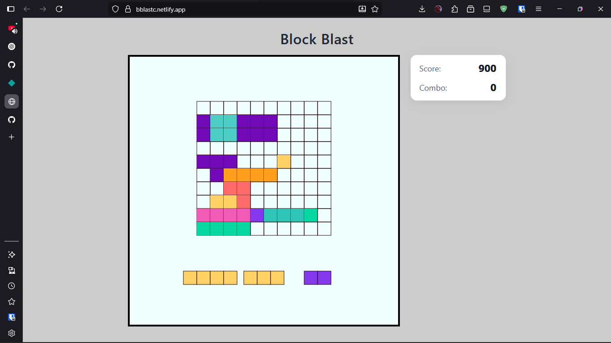
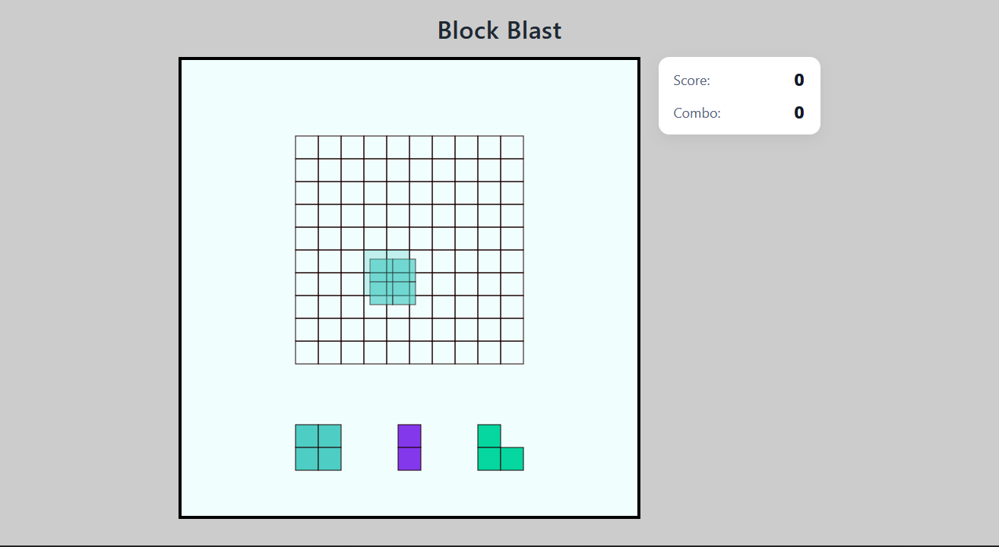
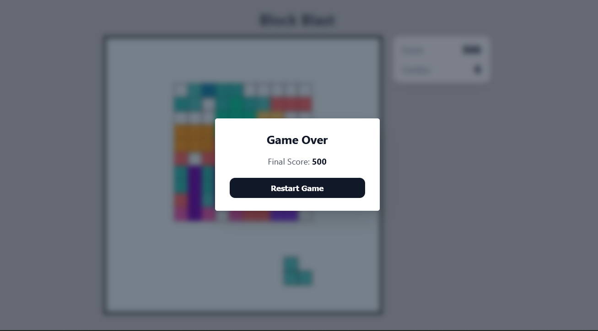

# Block Blast Clone

A simple **Block Blast–style puzzle game** built with **vanilla HTML, CSS, and JavaScript**.

The goal is to place randomly generated block shapes onto a grid, clear full rows or columns, and score as many points as possible before no valid moves remain.

This project was built as a learning-focused clone, with an emphasis on:
- clean game state management
- canvas-based rendering
- intuitive drag-and-drop interactions
- modular, readable code structure

Check out the live thing here 👉🏽 [demo](https://bblastc.netlify.app/)
---

## Gameplay Features

- Grid-based puzzle gameplay
- Drag-and-drop block placement
- Ghost preview for valid placements
- Line-clearing logic with combo scoring
- Block tray regeneration
- Game-over modal with restart flow

---

## Tech Stack

- **HTML** – structure
- **CSS** – layout, responsiveness, minimal UI styling
- **JavaScript (ES Modules)** – game logic, rendering, state management
- **Canvas API** – grid and block rendering

No frameworks, no libraries — just fundamentals.

---

## Getting Started

1. Clone the repository
   ```bash
   git clone https://github.com/your-username/block-blast-clone.git
   ```

2. Open `index.html` in your browser
   *(or use a local server for best results)*

That’s it.

---

## Project Structure (Simplified)

```
src/
├─ blocks.js        # Block shape definitions
├─ gameFunctions.js # Grid logic, placement rules, rendering helpers
├─ modal.js         # Game over modal logic
├─ script.js        # Main game loop and state
├─ styles.css       # UI styling
```

---

##  Purpose

This project is part of a series of small game builds focused on:

* strengthening problem-solving skills
* understanding game loops and rendering
* writing maintainable code 

If you're interested in more game projects, check them out here:
👉 **[Game Jam Series](https://github.com/ZLouisMiguel/game-jam-series)**

---

## Notes

This is a **clone for educational purposes**, not a commercial project.

Feel free to fork, experiment, or build on top of it.

## Screenshots

# Gameplay


# Block Placement Preview


# Game Over Modal


